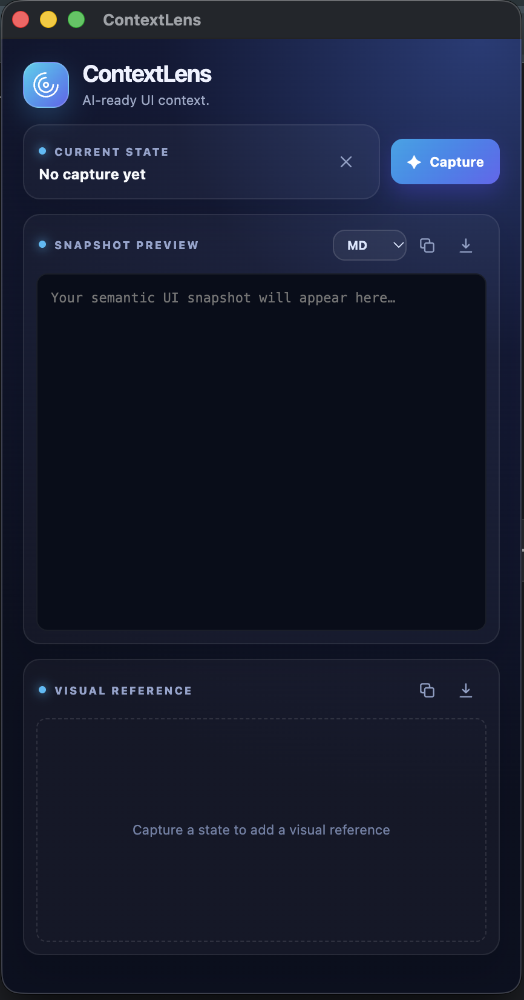
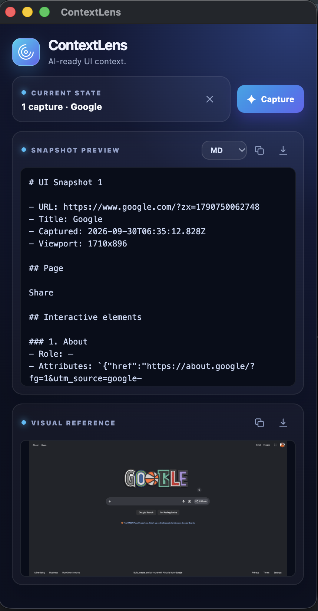

# ContextLens

> Capture any web UI and turn it into clean, visual context for AI coding agents and test automation.

**ContextLens is an early-stage, local-first Chrome extension for developers who want to give AI assistants the right UI context quickly.**

## Product preview

### Ready to capture

  
  

ContextLens is a local Chrome extension that captures the current state of a web application and turns it into compact context for AI coding agents and test automation.

It helps Codex, GitHub Copilot, Claude, Gemini, and similar tools understand a screen without requiring a Playwright setup first.

## How it works

1. Open a web application in Chrome.
2. Click the ContextLens toolbar icon.
3. A dedicated capture window opens and stays available while you work in the source tab.
4. Open the UI state you want to describe: a page, modal, dropdown, drawer, autocomplete list, validation error, or confirmation dialog.
5. Click **Capture**.
6. ContextLens extracts the semantic UI and captures a visual reference.
7. Copy or export the snapshot as Markdown or JSON, and optionally copy or download the screenshot.

Each new capture replaces the previous capture for the current tab, making it easy to recapture the latest state.

## Features

- Page URL, title, origin, timestamp, and viewport metadata
- Headings and meaningful UI sections
- Buttons, links, inputs, selects, tabs, checkboxes, radios, and menus
- Labels, roles, accessible names, and useful attributes
- Locator hints using IDs, names, test IDs, and roles
- Dialogs, overlays, drawers, and their controls
- Tables and visible validation errors
- Screenshot preview, clipboard copy, and PNG download
- Markdown and structured JSON export
- Common sensitive-value redaction by default, with user review recommended before sharing

The output can be pasted directly into an AI coding assistant for locator creation, test cases, automation steps, or UI analysis.

## Output formats

Markdown is readable context for humans and AI agents. JSON is structured snapshot data for tooling and programmatic processing. Screenshot data is kept separate and is not embedded as Base64 in Markdown or JSON exports.

## Privacy

ContextLens processes data locally in the browser. It uses no API key, backend, database, login, analytics, or external server.

Common password, hidden, payment, secret, token, SSN, and card-related fields are redacted by default using their standard types, names, labels, autocomplete hints, and related attributes. Application-specific secrets may not be recognized, so review snapshots before sharing them.

## Installation

1. Open `chrome://extensions` in Chrome.
2. Enable **Developer mode**.
3. Select **Load unpacked**.
4. Choose the folder containing `manifest.json`.
5. Open or reload the web application you want to inspect.

ContextLens works on normal web pages and app-opened web popup windows. Browser chrome, `chrome://` pages, native OS dialogs, cross-origin iframe internals, closed shadow roots, and canvas-only UI are outside the browser extension security boundary.
